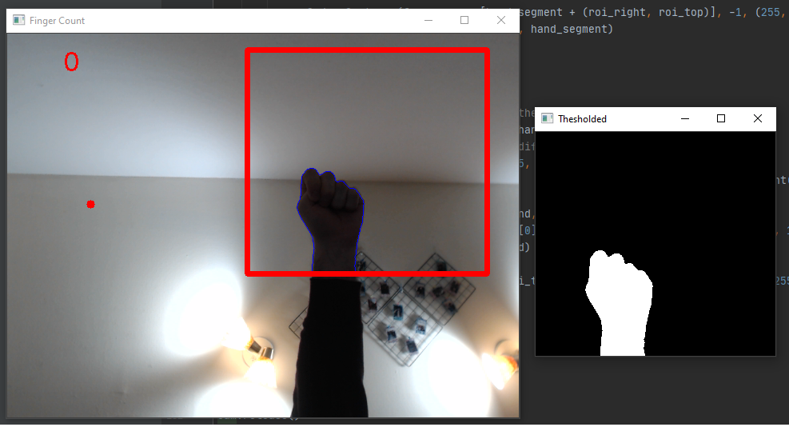
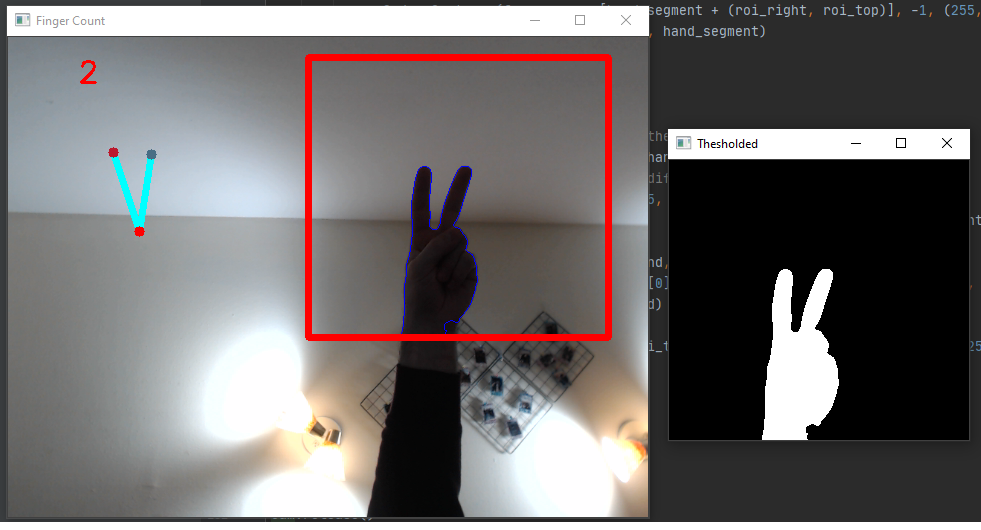
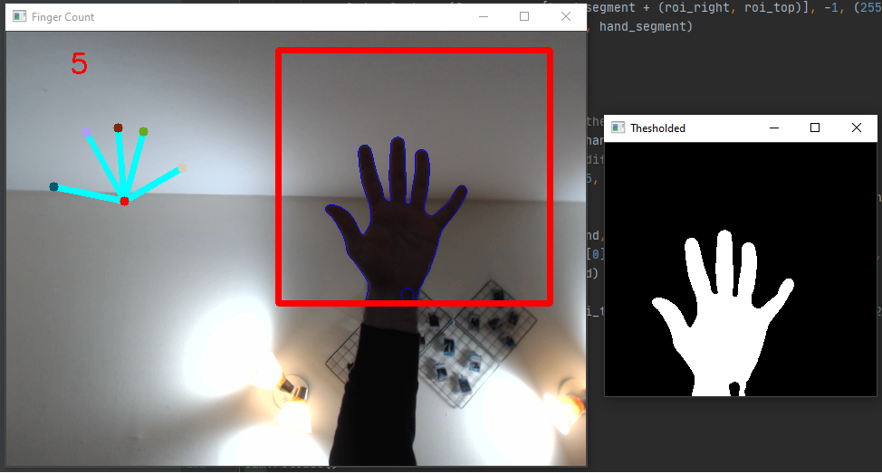

# Finger-Counter
 Counts the fingers shown.
 
 # Libraries 
 
  - cv2
  - numpy
  - sklearn
  - random
 
 # Definition
 
 This project is shown in one of the courses I took from Udemy. Briefly, a red box appears on the right side of the screen and by placing your hand in that area, 
 the number you show with your hand is written to the left corner of the screen. Furthermore, in the main video screen, there will points that presents the center 
 of the hand and top points of the fingers. Also there will be lines that connect the center of the hand and top points of the fingers to simulate the hand that 
 computer see.
 
 # Strategy for counting fingers
 
  - Used a Convex Hull to draw a polygon around the hand.
  - Calculate the center of the hand against the angle of outer points to infer finder count.
 
 # Screenshots
 
 

